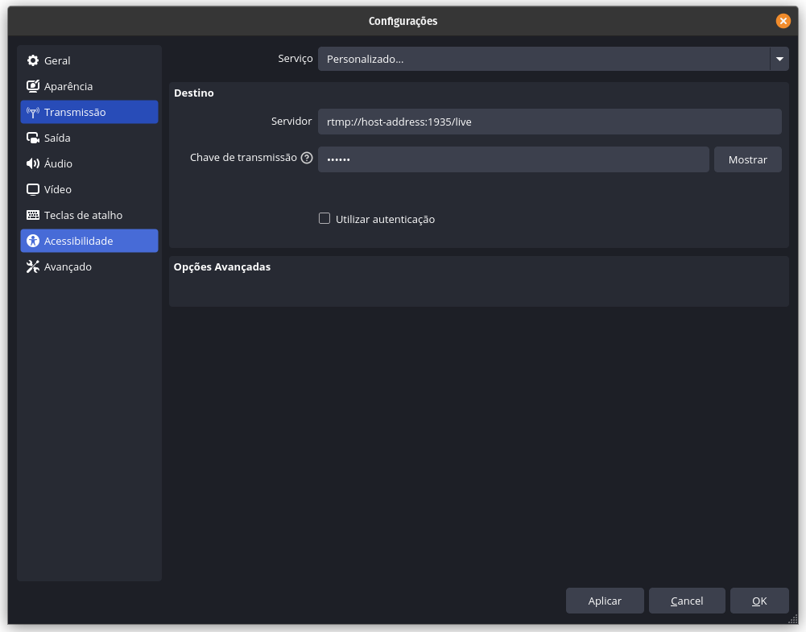

# Instructions to Use the VR Container

## Recorded 360° Video
Access the pre-recorded 360° video stream at:
https://host-address:8443/


## Live 360° Video
Access the live 360° stream at:
https://host-address:8443/live.html


## Streaming a Video to the RTMP Server
To broadcast a video stream to the RTMP server, use the following connection details:

**Server URL**
```shell
rtmp://host-address:1935/live
```

Stream Key
```shell
stream
```

## OBS configuration

Use these settings in OBS Studio to stream to the VR container.
